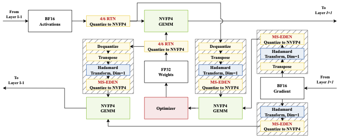
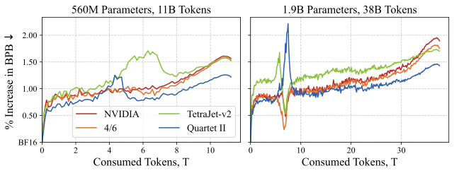
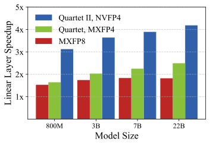

## The Core Problem

The introduction of the NVFP4 lower-precision format (natively supported by NVIDIA Blackwell GPUs) opens the door for end-to-end fully-quantized pre-training of massive Large Language Models (LLMs). However, existing quantized training methods compromise the format's representation capacity. Specifically, to achieve unbiased gradient estimation via stochastic rounding (SR), these methods sacrifice noticeable accuracy compared to standard FP16 and FP8 training.

## Key Observations
To solve this, the authors introduce **MS-EDEN**, a novel unbiased quantization routine specifically designed for micro-scaled formats. 
- **Reduced Error**: MS-EDEN provides more than 2x lower quantization error than traditional stochastic rounding (SR).
- **Quartet II Integration**: MS-EDEN is seamlessly integrated into a new fully-NVFP4 quantization scheme for linear layers, aptly named **Quartet II**. 

Analytically, Quartet II achieves consistently better gradient estimation across all major matrix multiplications—in both forward and backward passes. Furthermore, the proposal pairs exceptionally well with other recent performance enhancements aimed at NVFP4.

## Results

The authors validated Quartet II on end-to-end LLM training runs with up to 1.9 Billion parameters on 38 Billion tokens. 
- Supplied kernels for execution on NVIDIA Blackwell GPUs demonstrate an impressive **up to 4.2x speedup** over equivalent BF16 implementations.

## Links
- **[arXiv Paper](https://arxiv.org/abs/2601.22813)**
- **[GitHub Repository](https://github.com/IST-DASLab/Quartet-II)**

---
*Disclaimer: This blog post was automatically generated from the [arXiv paper](https://arxiv.org/abs/2601.22813).*
