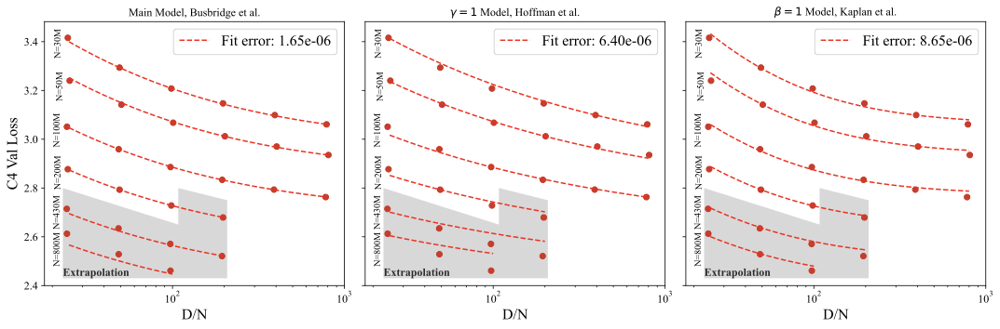
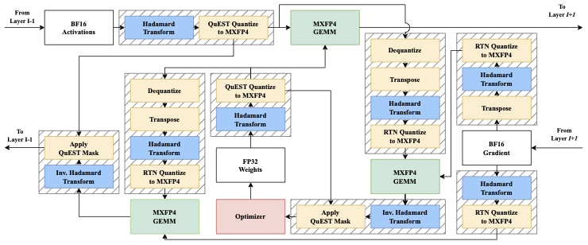
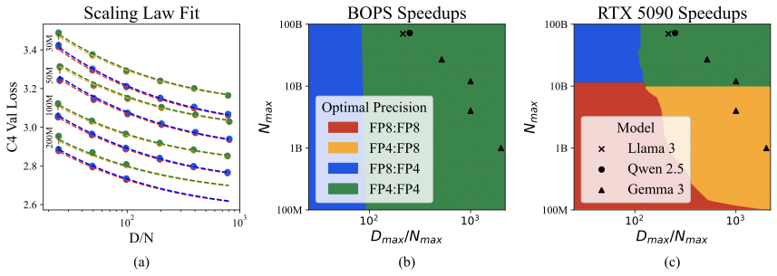

## The Low-Precision Training Challenge

When training large language models (LLMs), moving to low-precision offers a compelling way to improve throughput and energy efficiency. NVIDIA's recent Blackwell architecture even provides hardware support for very low-precision operations using FP4 variants. 

However, existing algorithms for training in FP4 face severe accuracy degradation. To compensate, they often fallback to mixed-precision, effectively leaving performance on the table.

## Key Observations

Instead of mixed-precision workarounds, we investigate end-to-end, native FP4 training. Through extensive evaluations on Llama-type models, we explored how to keep all major computations (linear layers) in pure low precision.

We reveal a new **low-precision scaling law** that precisely quantifies the performance trade-offs across different bit-widths and training setups.

## Introducing Quartet

Guided by this scaling law, we formulated **Quartet** — an optimal technique for balancing accuracy and computation in FP4.

We implemented Quartet using custom, optimized CUDA kernels tailored for the Blackwell architecture. What we discover is that fully FP4-based training can be a highly competitive alternative to both FP16 half-precision and FP8 training, closing the accuracy gap without sacrificing speed.

**[Read the Paper →](https://arxiv.org/abs/2505.14669)**
 
**[Code and Implementation →](https://github.com/IST-DASLab/Quartet)**

---
*Disclaimer: This blog post was automatically generated from the [arXiv paper](https://arxiv.org/abs/2505.14669).*
